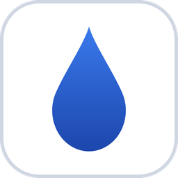

#  InkKeep

English | [繁體中文](README.zh-TW.md)

InkKeep is a Windows desktop tool for the text you type again and again. Press a global hotkey, search, and press Enter: InkKeep sends the snippet, bookmark URL or password to the app you were using. Snippets can hold dynamic placeholders such as dates, clipboard text and fill-in fields. Everything lives in a single KeePass KDBX file, so KeePassXC can open it too. InkKeep opens straight to the search box and asks for your master password only when you use a password entry.

## Quick Start

There are no pre-built binaries yet, so build InkKeep from source first (see [Building InkKeep](#building-inkkeep)) and run `inkkeep.exe`.

On first launch, a setup wizard asks where to keep the vault and for a master password. Put the vault in a synced folder such as OneDrive or Dropbox to share it between computers. The master password cannot be reset, so keep it somewhere safe.

After setup, InkKeep runs in the system tray. Press `Alt+.` to open the search window. The [User Guide](docs/user-guide.md) covers shortcuts, placeholders and every feature in detail.

## Features List

### Core Features

* Global hotkey search window that opens on the monitor you are working on and sends the selection to the app you were using
* Snippets, bookmarks and passwords in one KDBX 4 file that KeePassXC can open
* Snippet placeholders: dates and times with offsets and custom formats, clipboard text, cursor position, input fields, drop-down choices, UUIDs, and references to other snippets
* Passwords and usernames are typed with `SendInput` and never go through the clipboard
* Two-tier keys from one master password: the vault key is cached in Windows Credential Manager, and password fields are sealed with a public key, so saving a password needs no master password
* Filter by type (snippets, bookmarks, passwords) with Tab
* Workspaces to keep, for example, personal and work entries apart
* Password generator

### Advanced

* Import bookmarks from every Chrome, Edge and Firefox profile
* Import passwords from CSV exports of Chrome, Firefox, Bitwarden, 1Password, KeePassXC, LastPass and others
* Idle lock for passwords, while snippets and bookmarks stay available
* Verified saves: every write is read back and compared before it replaces the vault, with 3 rotating backups
* Detection of OneDrive and iCloud conflict copies
* Traditional Chinese and English interface, with light and dark themes
* Developer command line tool (`inkkeep-cli`)

For a full list of changes, read the [CHANGELOG](CHANGELOG.md). \
For keyboard shortcuts and details, see the [User Guide](docs/user-guide.md).

## Building InkKeep

You need [Rust](https://rustup.rs/) (MSVC toolchain), [Node.js](https://nodejs.org/) and pnpm.

```powershell
git clone https://github.com/John8805/InkKeep.git inkkeep
cd inkkeep
pnpm --dir ui install
pnpm --dir ui build
cd crates\inkkeep-app
..\..\ui\node_modules\.bin\tauri build --no-bundle
```

The executable is `target/release/inkkeep.exe`. Build with the Tauri CLI as shown; a plain `cargo build --release` produces a development build. The [Development Guide](docs/development.md) covers the dev server, project layout, tests and the developer CLI.

## Contributing

To report a bug or suggest a feature, open an [issue](https://github.com/John8805/InkKeep/issues) on GitHub. You can also submit a pull request; the [Development Guide](docs/development.md) explains how to build and test.

## License

InkKeep is licensed under the [MIT License](LICENSE).
